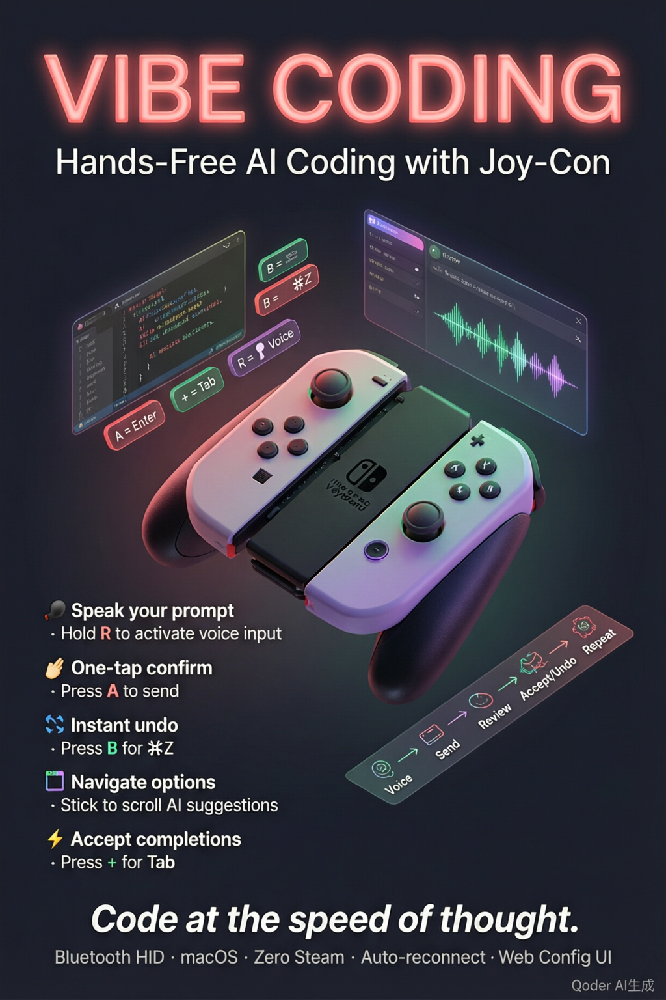
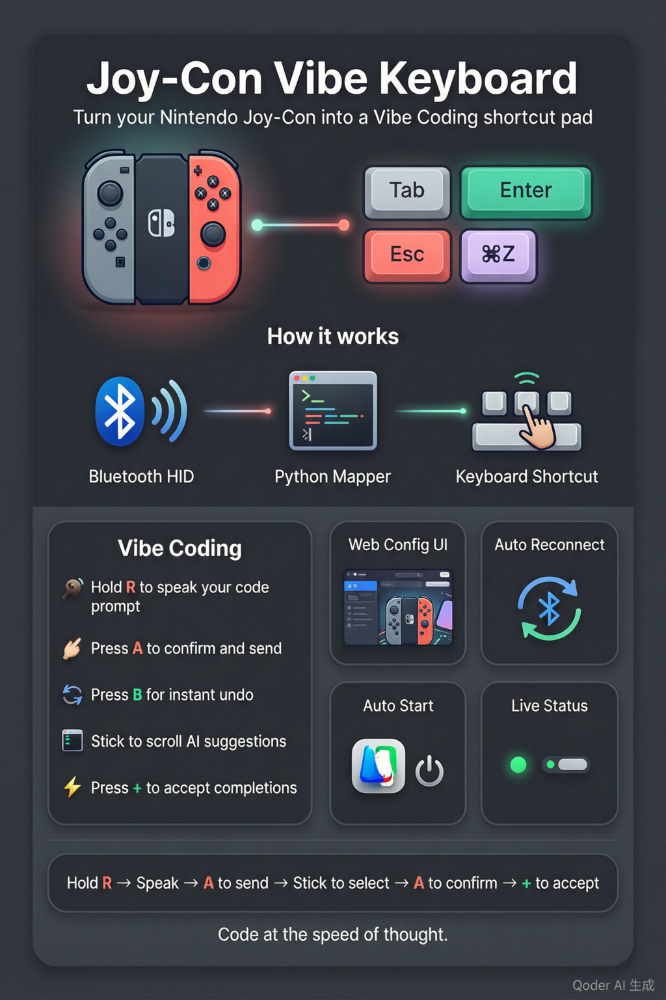

# Joy-Con Vibe Keyboard

> Use a Nintendo Joy-Con (R) as a one-handed shortcut keyboard for vibe coding with AI tools like Claude Code, Cursor, and Codex.


-lightgrey.svg)

## Why

When vibe coding, you spend most of your time on the same few actions — accept suggestion, undo, navigate options, trigger voice input. A Joy-Con in your hand gives you **physical, tactile shortcuts** without ever reaching for the keyboard. Hold a shoulder button as a modifier (like ⌘), then tap face buttons for common actions.

This project was born out of frustration with existing mapping tools:

- **Enjoyable** locks up when the Joy-Con gyroscope fires
- **Steam** desktop layout works but causes the MacBook to overheat
- **Karabiner-Elements** can't read Bluetooth HID gamepads
- **Joystick Mapper** costs $30 on the App Store

A ~500-line Python script turned out to be the most reliable, customizable, and lightweight solution.

<p align="center">
  
</p>

## Features

- **Hold-modifier buttons** — R and ZR act as modifier keys (Right ⌘, Right ⌥) that you hold down while pressing other buttons
- **Hold-to-talk voice** — SR holds Right ⌥ to trigger SaySo / macOS voice input (native HID event, press to start, release to stop)
- **Combo key support** — any button can fire a full key combination (e.g. B → ⌘+Z for undo) without holding a modifier first
- **Tap-to-cycle app switching** — each HOME tap advances the macOS app switcher (⌘+Tab) exactly once; stop tapping for 0.8 seconds to select
- **Analog stick mapping** — push the stick left/right to trigger arrow keys (navigate AI code suggestions)
- **Auto-reconnect** — if Bluetooth drops, the script waits and reconnects automatically
- **Bluetooth watchdog** — optional daemon reconnects at the Bluetooth level via `blueutil` when HID is lost
- **Web config UI** — cyberpunk-themed browser interface for visual configuration
- **JSON config** — all mappings live in `config.json`, human-editable and version-controllable
- **macOS LaunchAgent** — one-click auto-start on login via the web UI

## Requirements

- **macOS** (tested on macOS 26 Tahoe, Apple Silicon)
- **Joy-Con (R)** paired via Bluetooth
- **Python 3.9+**
- **Homebrew** (for native libraries)

> **Note:** This project is designed for the **right** Joy-Con. Left Joy-Con uses a different product ID and different button layout.

## Installation

```bash
# 1. Clone the repository
git clone https://github.com/MagnetQ/joycon-vibe-keyboard.git
cd joycon-vibe-keyboard

# 2. Install the native HID library
brew install hidapi

# 3. Install Python dependencies
pip3 install hidapi pynput

# 4. (Optional) For the Bluetooth watchdog
brew install blueutil
```

### Important: `hidapi` vs `hid`

This project uses **`hidapi`** (Cython binding), not `hid` (ctypes wrapper). Both packages export `import hid` and will conflict. If you have both installed:

```bash
pip3 uninstall hid -y
```

On macOS, SIP strips `DYLD_LIBRARY_PATH`, which causes the ctypes-based `hid` package to fail. The Cython-based `hidapi` works correctly.

### Accessibility Permission

The terminal (or app) running the mapper needs **macOS Accessibility permission** for keyboard simulation. Go to:

**System Settings → Privacy & Security → Accessibility** → add your terminal app.

SR's native Right Option event (Quartz CGEvent) also requires this permission.

## Quick Start

```bash
python3 joycon_mapper.py
```

The script reads `config.json`, prints the current mappings, and waits for a Joy-Con connection. Once connected, button presses are translated to keyboard events in real time.

Press `Ctrl+C` to stop.

## Default Mappings

| Button | Keyboard | Vibe Coding Use |
|--------|----------|----------------|
| R (hold) | Right ⌘ | Trigger Typeless / voice input |
| ZR (hold) | Right ⌘ + Right ⌥ | Secondary modifier combo |
| SR (hold) | Right ⌥ | Hold to trigger SaySo voice input |
| A | Enter | Confirm / send |
| B | ⌘+Z | Undo |
| X | Backspace | Delete |
| Y | Escape | Cancel / exit |
| PLUS | Tab | Accept AI code completion |
| MINUS | a | With R held → ⌘+A select all |
| HOME | ⌘ held + Tab per tap | Tap to cycle apps; 0.8s idle selects |
| STICK CLICK | d | With R held → ⌘+D |
| SL | c | With R held → ⌘+C copy |
| Stick left | ↑ | Navigate up in AI suggestions |
| Stick right | ↓ | Navigate down in AI suggestions |

> **Note on SR:** SR uses a native macOS HID event (Right Option, keycode 61) so SaySo recognizes the synthetic key. Regular `pynput` events are not accepted by SaySo.

## Configuration

All button mappings are stored in `config.json`:

```json
{
  "modifiers": {
    "R": ["cmd_r"],
    "ZR": ["cmd_r", "alt_r"],
    "SR": ["alt_r"]
  },
  "buttons": {
    "A": { "modifiers": [], "key": "enter" },
    "B": { "modifiers": ["cmd"], "key": "z" },
    "X": { "modifiers": [], "key": "backspace" },
    "Y": { "modifiers": [], "key": "esc" }
  },
  "stick": {
    "left": "up",
    "right": "down"
  }
}
```

Three config sections:

- **modifiers** — buttons that act as hold-down modifier keys. Value is an array of key names (e.g. `["cmd_r"]` or `["cmd_r", "alt_r"]`).
- **buttons** — action buttons that fire on press. Each has a `modifiers` array (empty for a single key, or filled for a combo like ⌘+Z) and a `key` for the main key.
- **stick** — maps stick push directions (`left`, `right`) to keyboard keys.

### Supported Key Names

| Category | Names |
|----------|-------|
| Special keys | `enter`, `tab`, `esc`, `backspace`, `delete`, `space`, `up`, `down`, `left`, `right`, `page_up`, `page_down` |
| Modifiers | `cmd`, `cmd_l`, `cmd_r`, `alt`, `alt_l`, `alt_r`, `ctrl`, `ctrl_l`, `ctrl_r`, `shift`, `shift_l`, `shift_r` |
| Function keys | `f1` through `f12` |
| Characters | `a`–`z`, `0`–`9` |

## Web Config UI

Start the optional web config server:

```bash
python3 config_server.py
```

Then open **http://localhost:8766** in your browser.

<p align="center">
  
</p>

The page shows an interactive SVG diagram of the Joy-Con alongside a card-based config panel. Click any button or card to edit its binding. Features include:

- **Interactive SVG** — hover over buttons to cross-highlight with the config cards
- **Modal editing** — dropdown selectors for modifiers and keys
- **Connection status** — real-time badge showing Joy-Con connection state
- **Auto-start toggle** — enable/disable macOS LaunchAgent (mapper runs on login)
- **Cyberpunk theme** — animated grid background, neon glow effects, glassmorphism

After saving, restart `joycon_mapper.py` for the new mappings to take effect.

### API Endpoints

| Method | Path | Description |
|--------|------|-------------|
| GET | `/` | Web config page |
| GET | `/api/config` | Current config.json |
| POST | `/api/config` | Save config.json |
| GET | `/api/status` | Joy-Con connection status |
| GET | `/api/autostart` | Auto-start enabled? |
| POST | `/api/autostart/enable` | Create LaunchAgent + start |
| POST | `/api/autostart/disable` | Stop + remove LaunchAgent |

## Bluetooth Watchdog

The optional watchdog daemon monitors the Bluetooth connection and auto-reconnects when the Joy-Con drops:

```bash
# Run in foreground
python3 joycon_watchdog.py

# Run as daemon
python3 joycon_watchdog.py --daemon
```

Requires `blueutil` (`brew install blueutil`). The watchdog finds the Joy-Con's MAC address via `system_profiler` and uses `blueutil --connect` to reconnect when HID is lost.

## How It Works

```
┌─────────────┐     Bluetooth HID      ┌──────────────────┐     pynput / Quartz     ┌───────────┐
│  Joy-Con R  │ ──────────────────────→ │ joycon_mapper.py │ ──────────────────────→ │   macOS   │
│  (0x057e    │   report 0x30 @ 4ms    │  (Python script) │   keyboard events       │  keyboard │
│   0x2006)   │                        │                  │                         │  buffer   │
└─────────────┘                        └──────────────────┘                         └───────────┘
                                              │
                                       reads config.json
                                       writes status.json
                                              │
                                       ┌──────────────────┐
                                       │ config_server.py │ ← optional web UI
                                       │  (port 8766)     │
                                       └──────────────────┘
```

The script opens the Joy-Con as a Bluetooth HID device using `hidapi`, then polls for input reports (report ID `0x30` or `0x21`) at 4ms intervals. Button states are extracted from specific bit positions in the report payload:

- **Bytes 3–4**: button bitfield (byte 3: A=0x08, B=0x04, X=0x02, Y=0x01, R=0x40, ZR=0x80, SL=0x20, SR=0x10; byte 4: PLUS=0x02, MINUS=0x01, HOME=0x10, STICK_CLICK=0x04)
- **Bytes 9–10**: analog stick X-axis (center ~2048, range 0–4095, deadzone 600)

When a button transitions from released to pressed, the script simulates the corresponding keyboard event via `pynput`. The SR modifier uses a native Quartz `flagsChanged` event instead, so SaySo accepts it.

If no data arrives for ~5 seconds, the script assumes the Joy-Con has disconnected and enters an auto-reconnect loop.

## Project Structure

```
joycon-vibe-keyboard/
├── joycon_mapper.py      # Main script — reads HID, simulates keyboard
├── config.json           # Button mapping configuration
├── config_server.py      # Optional web config server (port 8766)
├── joycon_watchdog.py    # Optional Bluetooth reconnect watchdog
├── web/
│   ├── joycon_config.html  # Interactive web config page (cyberpunk theme)
│   └── keymap.html         # Static reference page
├── tools/
│   ├── test_buttons.py     # Debug: button press detection
│   └── debug_stick.py      # Debug: analog stick values
├── tests/
│   └── test_home_app_switcher.py  # Unit tests for HOME tap-cycle
├── assets/
│   ├── project-overview.png
│   └── vibe-coding-poster.png
├── docs/
│   └── DESIGN.md           # Architecture and design document (Chinese)
├── LICENSE
└── README.md
```

## Known Limitations

- **macOS only** — `pynput` and `hidapi` work on macOS; Linux/Windows would need adaptations for keyboard simulation
- **Accessibility permission required** — the terminal running the mapper needs macOS Accessibility permission
- **One process per HID device** — only one script can open the Joy-Con at a time; stop the mapper before running debug tools
- **No hot-reload** — changing `config.json` requires restarting `joycon_mapper.py`
- **Third-party Joy-Con quirks** — some aftermarket controllers have a dead Y-axis on the analog stick (this project maps X-axis left/right to up/down as a workaround)
- **Bluetooth range** — occasional drops at distance; auto-reconnect handles this gracefully
- **LaunchAgent deprecated API** — `launchctl load/unload -w` works on current macOS but may be deprecated in future versions

## Troubleshooting

**"No Joy-Con found"**
Make sure the Joy-Con is paired via Bluetooth (System Settings → Bluetooth). The script uses vendor ID `0x057e` and product ID `0x2006`.

**"hid module not found" or "OSError: hidapi"**
Make sure `hidapi` (not `hid`) is installed: `pip3 list | grep hid`. If both are present, `pip3 uninstall hid -y`.

**Keyboard events not working in some apps**
Some apps (like Typeless) don't recognize `pynput` synthetic events. The SR button uses native Quartz events as a workaround. For other buttons, this is a known limitation.

**Bluetooth keeps disconnecting**
Use the watchdog (`joycon_watchdog.py --daemon`) for automatic reconnection. Also check for Bluetooth interference from other devices.

**Config server won't start**
Port 8766 might be in use. Check with `lsof -i :8766` and kill the conflicting process, or change the port in `config_server.py`.

## Contributing

This is a personal-use tool, but contributions are welcome! Areas that could use improvement:

- Linux / Windows support for keyboard simulation
- Config hot-reload (watch `config.json` for changes)
- Joy-Con (L) support
- Better error handling and logging
- More comprehensive test coverage

## License

[MIT](LICENSE)
